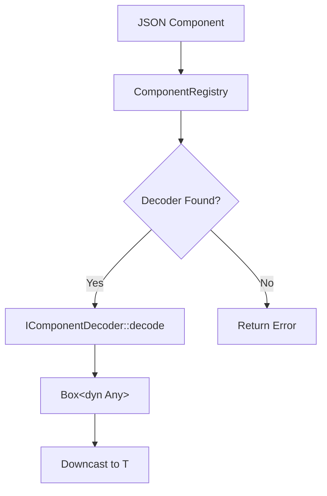
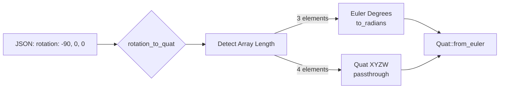

# vibe-ecs-bridge

Type-safe decoder registry for Three.js ECS JSON → Rust structs.

## Architecture



**Why `Box<dyn Any>`?** Enables heterogeneous return types. Registry stores different decoders, caller downcasts to expected type.

## ComponentCapabilities

Metadata for render graph optimization:

```rust
ComponentCapabilities {
    affects_rendering: bool,        // Triggers re-render?
    requires_pass: Option<&str>,    // "geometry", "shadow", "post"
    stable: bool,                   // API won't change?
}
```

Allows conditional pass compilation based on scene components.

## Transform Utilities - THE CRITICAL MODULE

### Degrees vs Radians Bug

**Root cause**: TypeScript stores rotation in **DEGREES**, Rust (glam) expects **RADIANS**.



**Standardized API:**

| Function               | Input               | Output | Handles                                                      |
| ---------------------- | ------------------- | ------ | ------------------------------------------------------------ |
| `rotation_to_quat_opt` | `Option<&Vec<f32>>` | `Quat` | Auto-detect Euler(3)/Quat(4), degrees→radians, None→IDENTITY |
| `position_to_vec3_opt` | `Option<&[f32; 3]>` | `Vec3` | None→ZERO                                                    |
| `scale_to_vec3_opt`    | `Option<&[f32; 3]>` | `Vec3` | None→ONE                                                     |

**Real Bug**: Plane `rotation: [-90, 0, 0]` treated as radians → `-5156°` rotation → physics objects slide downhill instead of falling.

### Migration Checklist

When writing code that reads transforms:

1. ✅ `use vibe_ecs_bridge::{rotation_to_quat_opt, position_to_vec3_opt, scale_to_vec3_opt}`
2. ✅ Never manually convert degrees→radians (easy to forget)
3. ✅ Test with `-90°` rotation (horizontal plane) to verify correct conversion

### Coordinate System

- Right-handed, Y-up, +Z forward, +X right (Three.js compatible)
- Euler order: XYZ

## Decoder Implementation Pattern

```rust
impl IComponentDecoder for MyDecoder {
    fn can_decode(&self, kind: &str) -> bool { kind == "MyComponent" }

    fn decode(&self, value: &Value) -> Result<Box<dyn Any>> {
        let component: MyComponent = serde_json::from_value(value.clone())?;
        Ok(Box::new(component))
    }

    fn capabilities(&self) -> ComponentCapabilities {
        ComponentCapabilities::rendering("geometry")
    }

    fn component_kinds(&self) -> Vec<ComponentKindId> {
        vec![ComponentKindId::new("MyComponent")]
    }
}
```

Register in `create_default_registry()`.

## Testing

All decoders have unit tests + real scene JSON parity checks.

**Critical tests**: `transform_utils.rs` verifies `-90° Euler` → horizontal plane orientation.

`cargo test -p vibe-ecs-bridge`
