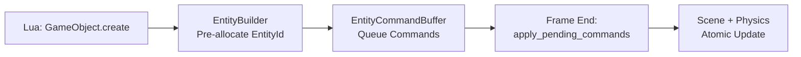

# ECS Manager - Mutable Scene Operations

## Command Buffer Pattern

Deferred mutations solve thread-safety and mid-frame consistency:



**Critical**: `build()` returns EntityId immediately but entity doesn't exist until `apply_pending_commands()`.

## Thread Safety Architecture

```rust
// Arc<SceneState> for shared ownership across Lua closures
Arc<Mutex<RwLock<Scene>>>
      ↓            ↓
   Mutex       RwLock
  (Send+Sync)  (multi-reader)
```

**Why not RefCell?** Lua closures cross thread boundaries → need `Send + Sync`.

## Physics Synchronization

### Lifecycle Hooks

`on_entity_created` / `on_entity_destroyed` automatically sync entities with RigidBody/MeshCollider to Rapier PhysicsWorld.

### Critical Gotchas

**Rotation Conversion**: ALWAYS use `vibe_ecs_bridge::rotation_to_quat_opt` - JSON stores degrees, Rapier expects radians.

**Collider-Only Entities**: MeshCollider without RigidBody → creates implicit Fixed body (matches Three.js).

**Scale Application**: `Transform.scale` multiplies collider base size (collider_size × scale, not applied twice).

## Component Decoding Pattern

```rust
fn get_component<T: 'static>(&self, entity: &Entity, name: &str) -> Option<T> {
    entity.components.get(name)
        .and_then(|val| self.registry.decode(name, val).ok())
        .and_then(|boxed| boxed.downcast::<T>().ok())
        .map(|boxed| *boxed)
}
```

Registry provides type-safe decoding from JSON `Value` → Rust structs.

## Performance Characteristics

- **Bulk create**: 1000 entities <1s
- **Physics sync**: 500 entities <2s
- **Memory**: 1000 create/destroy cycles stable (no leaks)

## Entity ID Pre-Allocation

```rust
let id = manager.create_entity().with_name("Player").build();
// id is valid NOW, entity created on apply_pending_commands()
// Enables parent/child setup:
let child = manager.create_entity().with_parent(Some(id)).build();
manager.apply_pending_commands()?;
```

## Testing Structure

35 tests across 4 categories:

- `entity_builder_test.rs` - Fluent API
- `scene_manager_test.rs` - Entity lifecycle
- `physics_sync_test.rs` - Transform sync & collider types
- `stress_test.rs` - Memory leaks, bulk operations

**Run**: `cargo test -p vibe-ecs-manager`

## Lua Integration Pattern

```rust
pub fn install_gameobject_api(lua: &Lua, scene_manager: Arc<Mutex<SceneManager>>) {
    let sm = scene_manager.clone();  // Cheap Arc clone
    lua.create_function(move |_, name: String| {
        let mut mgr = sm.lock().unwrap();
        Ok(mgr.create_entity().with_name(&name).build().as_u64())
    })
}
```

**Key**: Each closure clones Arc (ref count bump), locks Mutex for mutation.

## Related Docs

- `/rust/engine/crates/physics/CLAUDE.md` - Transform sync details
- `/rust/PRDs/mutable-ecs-architecture.md` - Original design
