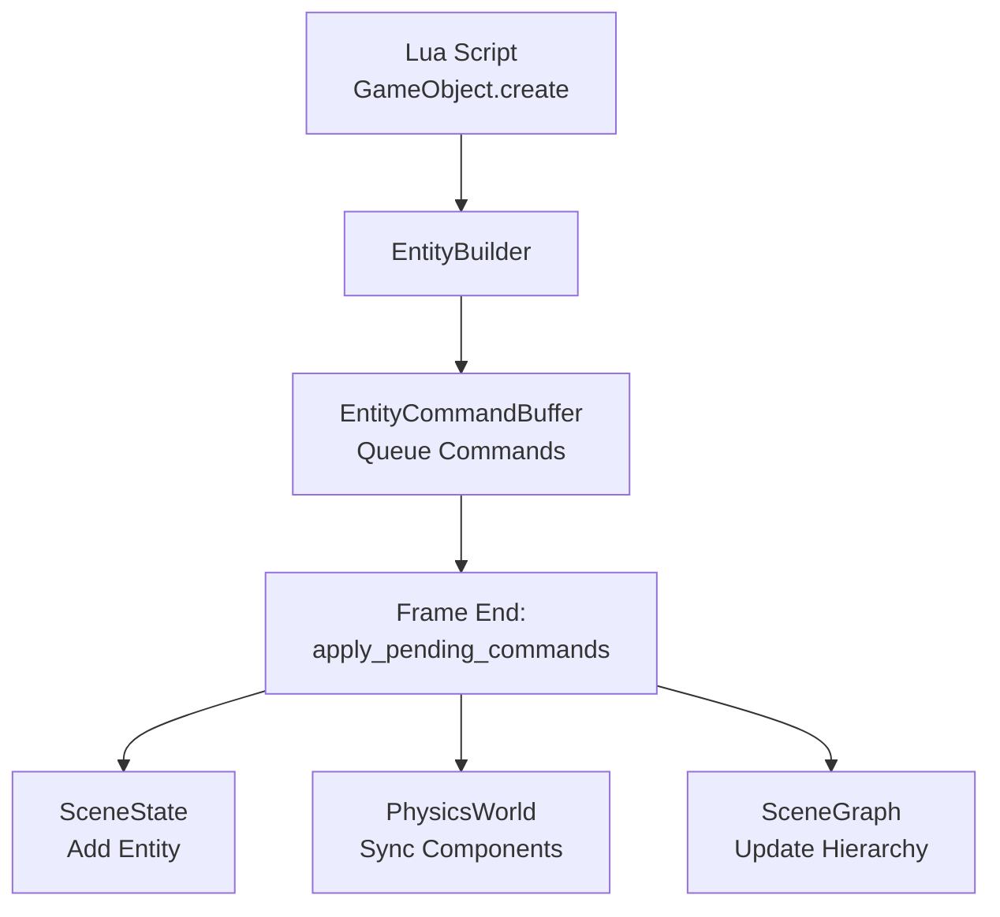

# ECS Manager - Mutable Scene Operations

## Overview

The `vibe-ecs-manager` crate provides runtime entity creation, modification, and destruction through a command buffer pattern. This implements the **Mutable ECS Architecture** PRD for the Vibe Coder 3D engine.

## Architecture

### Command Buffer Pattern

**Problem**: ECS requires thread-safe mutations during frame updates
**Solution**: Queue commands in buffer, apply atomically at frame end



**Benefits:**

- ✅ Prevents mid-frame inconsistencies
- ✅ Batch operations for performance
- ✅ Atomic transactions (all succeed or all fail)
- ✅ Thread-safe with Arc<Mutex<T>>

## Core Components

### SceneManager

**Purpose**: Central coordinator owning all mutable state

```rust
pub struct SceneManager {
    state: Arc<SceneState>,           // Thread-safe scene mutations
    physics_world: PhysicsWorld,      // Rapier physics simulation
    command_buffer: EntityCommandBuffer, // Deferred commands
    registry: ComponentRegistry,      // Component type registry
}
```

**Key Methods:**

| Method                     | Purpose                  | When to Use            |
| -------------------------- | ------------------------ | ---------------------- |
| `create_entity()`          | Start entity builder     | Creating new entities  |
| `destroy_entity(id)`       | Queue entity destruction | Removing entities      |
| `apply_pending_commands()` | Execute queued commands  | Frame end              |
| `scene_state()`            | Read scene data          | Querying entities      |
| `physics_world_mut()`      | Access physics           | Manual physics queries |

**Thread Safety:**

- Uses `Arc<SceneState>` for shared ownership across Lua closures
- `Mutex<RwLock<Scene>>` for interior mutability
- Requires `Send + Sync` for Lua function closures

### EntityBuilder

**Purpose**: Fluent API for entity creation

```rust
let entity_id = manager
    .create_entity()
    .with_name("Player")
    .with_position([0.0, 5.0, 0.0])
    .with_rotation([0.0, 45.0, 0.0])  // Degrees!
    .with_scale([1.0, 1.0, 1.0])
    .with_component("RigidBody", json!({
        "enabled": true,
        "bodyType": "dynamic",
        "mass": 1.0
    }))
    .build();  // Returns EntityId immediately

manager.apply_pending_commands()?;  // Actually creates entity
```

**Important:**

- `build()` returns `EntityId` synchronously (pre-allocated)
- Entity not created until `apply_pending_commands()`
- Allows referencing entity ID before creation (e.g., parent/child setup)

### EntityCommandBuffer

**Purpose**: Queue of deferred mutations

**Command Types:**

```rust
pub enum EntityCommand {
    CreateEntity { entity_id, name, parent_id, components },
    DestroyEntity { entity_id },
    SetComponent { entity_id, component_type, data },
    RemoveComponent { entity_id, component_type },
    SetParent { entity_id, parent_id },
    SetActive { entity_id, active },
}
```

**Execution:**

```rust
// Queue commands (fast, non-blocking)
manager.create_entity().with_name("Foo").build();
manager.destroy_entity(old_id);

// Apply atomically (locks scene, executes all)
manager.apply_pending_commands()?;
```

### SceneState (Thread-Safe Wrapper)

**Purpose**: Thread-safe scene mutations with Arc<Mutex<RwLock<Scene>>>

**Pattern:**

```rust
// Arc for shared ownership
let state: Arc<SceneState> = Arc::new(SceneState::new(scene));

// Clone Arc for Lua closure (cheap, just ref count increment)
let state_clone = state.clone();
lua.create_function(move |_, ()| {
    state_clone.with_scene(|scene| {
        // Exclusive access to scene
        scene.add_entity(entity)
    })
})
```

**Why Mutex instead of RefCell?**

- RefCell: NOT Send/Sync → can't cross thread boundaries
- Mutex: Send + Sync → required for Lua closures

## Physics Synchronization

### Lifecycle Hooks

**on_entity_created()** - Called after entity added to scene:

```rust
fn on_entity_created(&mut self, entity_id: EntityId) -> Result<()> {
    // Check if entity has physics components
    let has_physics = self.state.with_scene(|scene| {
        scene.find_entity(entity_id)
            .map(|e| e.has_component("RigidBody") || e.has_component("MeshCollider"))
            .unwrap_or(false)
    });

    if has_physics {
        self.sync_entity_to_physics(entity_id)?;
    }

    Ok(())
}
```

**on_entity_destroyed()** - Called before entity removed:

```rust
fn on_entity_destroyed(&mut self, entity_id: EntityId) -> Result<()> {
    // Remove from physics world
    self.physics_world.remove_entity(entity_id);
    Ok(())
}
```

### Component Decoding

**Problem**: JSON component data → Rust types
**Solution**: ComponentRegistry with type-safe decoders

```rust
fn get_component<T: 'static>(&self, entity: &Entity, name: &str) -> Option<T> {
    entity
        .components
        .get(name)
        .and_then(|value| self.registry.decode(name, value).ok())
        .and_then(|boxed| boxed.downcast::<T>().ok())
        .map(|boxed| *boxed)
}

// Usage
let rigid_body = self.get_component::<RigidBody>(&entity, "RigidBody");
let mesh_collider = self.get_component::<MeshCollider>(&entity, "MeshCollider");
```

### Physics Sync Implementation

**Steps:**

1. Get entity components from scene
2. Decode RigidBody and MeshCollider via registry
3. Extract Transform (position, rotation, scale)
4. Build Rapier rigid body with correct body type
5. Build colliders with scale applied
6. Add to PhysicsWorld with entity ID mapping

**Critical:**

- Uses `vibe_ecs_bridge::transform_utils` for rotation conversion (degrees → radians)
- Handles collider-only entities (creates Fixed body)
- Skips disabled components (`enabled: false`)
- Applies scale to collider size

**Example:**

```rust
fn sync_entity_to_physics(&mut self, entity_id: EntityId) -> Result<()> {
    use vibe_ecs_bridge::{rotation_to_quat_opt, position_to_vec3_opt, scale_to_vec3_opt};

    let entity = self.state.with_scene(|scene| {
        scene.find_entity(entity_id).cloned()
    }).context("Entity not found")?;

    // Decode components
    let rigid_body = self.get_component::<RigidBody>(&entity, "RigidBody");
    let mesh_collider = self.get_component::<MeshCollider>(&entity, "MeshCollider");

    // Get transform using standardized utilities
    let transform = self.get_component::<Transform>(&entity, "Transform");
    let (position, rotation, scale) = if let Some(t) = transform {
        (
            position_to_vec3_opt(t.position.as_ref()),
            rotation_to_quat_opt(t.rotation.as_ref()),  // Handles degrees → radians
            scale_to_vec3_opt(t.scale.as_ref()),
        )
    } else {
        (Vec3::ZERO, Quat::IDENTITY, Vec3::ONE)
    };

    // Build rigid body + colliders
    // ...

    // Add to physics world
    self.physics_world.add_entity(entity_id, rapier_body, colliders)?;

    Ok(())
}
```

## Testing

### Test Organization

All test files are separate modules (not inline `#[cfg(test)]`):

```
src/
├── entity_builder.rs
├── entity_builder_test.rs       (6 tests)
├── scene_manager.rs
├── scene_manager_test.rs        (11 tests)
├── physics_sync_test.rs         (10 tests)
└── stress_test.rs               (8 tests)
```

**Total: 35 tests**

### Test Categories

**1. Unit Tests** (`entity_builder_test.rs`, `scene_manager.rs`)

- Basic functionality of individual modules
- Command queueing and execution
- Entity ID allocation

**2. Integration Tests** (`scene_manager_test.rs`, `physics_sync_test.rs`)

- Full entity lifecycle (create → apply → verify)
- Physics component synchronization
- Component updates and hierarchy

**3. Stress Tests** (`stress_test.rs`)

- Memory leak detection (1000+ cycles)
- Bulk operations (1000 entities)
- Physics sync at scale (500 entities)
- Performance benchmarks

**Running Tests:**

```bash
# All tests
cargo test -p vibe-ecs-manager

# Specific category
cargo test -p vibe-ecs-manager stress

# Single test
cargo test -p vibe-ecs-manager test_physics_sync_dynamic_sphere
```

### Performance Results

From stress tests:

- **Bulk creation**: 1000 entities in <1 second
- **Physics sync**: 500 entities in <2 seconds
- **Create/destroy cycles**: 1000 cycles stable (no leaks)

## Integration with Lua (GameObject API)

### API Implementation

Located in `/rust/engine/src/apis/gameobject_api.rs`:

```lua
-- Create entity
local id = GameObject.create("Enemy")
GameObject.setPosition(id, {0, 5, 0})
GameObject.setRotation(id, {0, 45, 0})

-- Create with primitive
local cubeId = GameObject.createPrimitive("Cube", "MyCube")

-- Destroy entity
GameObject.destroy(id)
```

**Implementation Pattern:**

```rust
pub fn install_gameobject_api(
    lua: &Lua,
    scene_manager: Arc<Mutex<SceneManager>>,
) -> mlua::Result<()> {
    let gameobject_table = lua.create_table()?;

    // Clone Arc for each closure
    let sm = scene_manager.clone();
    gameobject_table.set(
        "create",
        lua.create_function(move |_, name: String| {
            let mut manager = sm.lock().unwrap();
            let entity_id = manager.create_entity()
                .with_name(&name)
                .build();
            Ok(entity_id.as_u64())
        })?,
    )?;

    lua.globals().set("GameObject", gameobject_table)?;
    Ok(())
}
```

**Thread Safety:**

- `Arc<Mutex<SceneManager>>` allows shared mutable access
- Each Lua function clones Arc (cheap ref count increment)
- Mutex lock ensures exclusive access during mutations

## Common Patterns

### Creating Entities with Physics

```rust
let entity_id = manager
    .create_entity()
    .with_name("Dynamic Sphere")
    .with_position([0.0, 10.0, 0.0])
    .with_component("RigidBody", json!({
        "enabled": true,
        "bodyType": "dynamic",
        "mass": 1.0,
        "gravityScale": 1.0,
        "canSleep": true
    }))
    .with_component("MeshCollider", json!({
        "enabled": true,
        "colliderType": "sphere",
        "size": {"radius": 0.5},
        "center": [0.0, 0.0, 0.0],
        "isTrigger": false,
        "physicsMaterial": {
            "friction": 0.5,
            "restitution": 0.3,
            "density": 1.0
        }
    }))
    .build();

manager.apply_pending_commands()?;
```

### Creating Parent/Child Hierarchies

```rust
// Create parent
let parent_id = manager.create_entity()
    .with_name("Parent")
    .build();

// Create child
let child_id = manager.create_entity()
    .with_name("Child")
    .with_parent(Some(parent_id))
    .build();

manager.apply_pending_commands()?;
```

### Destroying Entities

```rust
manager.destroy_entity(entity_id);
manager.apply_pending_commands()?;

// Verify destruction
assert!(!manager.scene_state().has_entity(entity_id));
```

## Performance Considerations

### Command Buffer Benefits

**Batching**: Queue 1000 commands, execute once
**Locking**: Single lock per frame instead of per operation
**Atomicity**: All-or-nothing execution

### When to Apply Commands

**Option 1**: Frame-end (recommended)

```rust
// In main loop
loop {
    // Scripts create/destroy entities
    script_system.update(&mut scene_manager)?;

    // Apply all changes
    scene_manager.apply_pending_commands()?;

    // Render with consistent state
    renderer.render(&scene_manager)?;
}
```

**Option 2**: Manual control

```rust
// Create multiple entities
for i in 0..100 {
    manager.create_entity().with_name(&format!("Entity {}", i)).build();
}

// Apply in one batch
manager.apply_pending_commands()?;
```

### Memory Management

**Arc<T> vs Clone:**

- Arc: Cheap (just ref count increment)
- Clone: Expensive (deep copy)

**Mutex vs RefCell:**

- Mutex: Thread-safe, required for Lua
- RefCell: Single-threaded only

## Troubleshooting

### Entity ID Mismatch

**Problem**: Entity ID from `build()` doesn't match actual entity
**Cause**: Not calling `apply_pending_commands()`

**Solution:**

```rust
let entity_id = manager.create_entity().with_name("Foo").build();
manager.apply_pending_commands()?;  // REQUIRED!
assert!(manager.scene_state().has_entity(entity_id));
```

### Physics Not Syncing

**Problem**: Entity has physics components but no collisions
**Cause**: Component not enabled or wrong format

**Solution:**

```rust
// ✅ CORRECT
"RigidBody", json!({"enabled": true, "bodyType": "dynamic", "mass": 1.0})

// ❌ WRONG - disabled
"RigidBody", json!({"enabled": false, ...})

// ❌ WRONG - missing required fields
"RigidBody", json!({"bodyType": "dynamic"})
```

### Rotation Bugs

**Problem**: Objects rotated incorrectly after creation
**Cause**: Forgetting degrees → radians conversion

**Solution:**

```rust
// ✅ CORRECT - uses standardized utilities
use vibe_ecs_bridge::rotation_to_quat_opt;
let rotation = rotation_to_quat_opt(transform.rotation.as_ref());

// ❌ WRONG - manual conversion
let rotation = Quat::from_euler(glam::EulerRot::XYZ, rot[0], rot[1], rot[2]);
```

See `/rust/engine/crates/physics/CLAUDE.md` for full transform conventions.

## Future Enhancements

### Planned Features

- [ ] Component modification API (`GameObject.setComponent`)
- [ ] Batch destroy API (`GameObject.destroyAll(tag)`)
- [ ] Entity queries (`GameObject.findByTag`, `GameObject.findByName`)
- [ ] Event system (onEntityCreated, onEntityDestroyed)
- [ ] Prefab instantiation integration

### Performance Optimizations

- [ ] Parallel command execution (non-overlapping entities)
- [ ] Command compression (merge redundant operations)
- [ ] Memory pooling for frequent allocations

## Related Documentation

- `/rust/engine/CLAUDE.md` - Rust engine guidelines
- `/rust/engine/crates/physics/CLAUDE.md` - Physics sync details
- `/rust/PRDs/mutable-ecs-architecture.md` - Original PRD
- `/rust/PRDs/scripting-runtime-integration.md` - GameObject API spec
