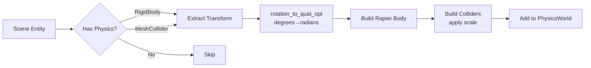

# vibe-physics

Rapier3D integration bridging Three.js physics components to native simulation.

## Critical: Transform Sync

**ALWAYS use `vibe_ecs_bridge::transform_utils`**. TypeScript stores rotation in DEGREES, Rapier expects RADIANS.

```rust
use vibe_ecs_bridge::{rotation_to_quat_opt, position_to_vec3_opt, scale_to_vec3_opt};

// ✅ CORRECT - handles degrees→radians automatically
let rotation = rotation_to_quat_opt(transform.rotation.as_ref());

// ❌ WRONG - treats degrees as radians
let rotation = Quat::from_euler(glam::EulerRot::XYZ, rot[0], rot[1], rot[2]);
```

See `/rust/engine/crates/ecs-bridge/CLAUDE.md` for full transform utilities docs.

## Scene Integration Flow



**Entry Point**: `populate_physics_world(world, scene, registry)`

## Three.js Parity Rules

| Behavior             | Implementation                                           |
| -------------------- | -------------------------------------------------------- |
| Collider-only entity | Creates implicit Fixed (static) body                     |
| `enabled: false`     | Skip during population                                   |
| Transform.scale      | Multiplies collider base size                            |
| Rotation units       | JSON degrees → Rapier radians via `rotation_to_quat_opt` |

## Collider Size Conventions

**Rapier vs Three.js units:**

| Collider | Rapier API           | JSON Field                           | Notes                     |
| -------- | -------------------- | ------------------------------------ | ------------------------- |
| Box      | Half-extents         | width/height/depth (full)            | Divide by 2 before Rapier |
| Sphere   | Radius               | radius                               | Direct                    |
| Capsule  | Radius + half-height | capsuleRadius, capsuleHeight (total) | Height includes caps      |
| Cylinder | Radius + half-height | radius, height (full)                | Divide height by 2        |

**Scale Application**: Applied AFTER base size calculation:

```rust
let half_extents = Vec3::new(width, height, depth) * 0.5 * scale;
ColliderBuilder::cuboid(half_extents.x, half_extents.y, half_extents.z)
```

## Common Pitfalls

### ❌ Forgetting Degrees → Radians

**Symptom**: Plane `rotation: [-90, 0, 0]` becomes slanted ramp, objects slide.

**Fix**: Use `rotation_to_quat_opt` - handles conversion automatically.

### ❌ Applying Scale Twice

**Wrong**:

```rust
let width = component.size.width * scale.x;  // Don't do this
let half_extents = Vec3::new(width, height, depth) * 0.5;
```

**Correct**: Let `ColliderBuilder` handle scale internally.

### ❌ Half-Extents Confusion

**Wrong**: Using full size for cuboid (creates 2x too large collider).

**Correct**: Divide full size by 2 before `SharedShape::cuboid()`.

## PhysicsWorld Key Methods

- `add_entity(entity_id, body, colliders)` - Register entity with Rapier
- `step(delta)` - Advance simulation
- `get_entity_transform(entity_id)` - Read physics-updated position/rotation
- `remove_entity(entity_id)` - Cleanup on entity destruction

## Testing

Integration tests verify:

- ✅ Transform extraction (degrees → radians)
- ✅ Collider-only → Fixed body creation
- ✅ Scale application
- ✅ Disabled component skip

**Run**: `cargo test -p vibe-physics`

**Validate**: `yarn rust:engine --scene testphysics` - objects fall straight down, no sliding.

## Coordinate System

Right-handed, Y-up, +Z forward (matches Three.js). Euler order: XYZ.
