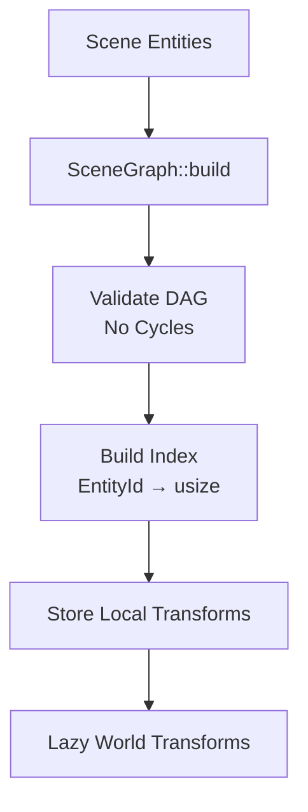

# vibe-scene-graph

Parent/child hierarchy with lazy transform propagation.

## Architecture



**Key Features:**

- Builds DAG from `parentPersistentId` references
- Detects cycles at build time (prevents infinite loops)
- Lazy transform updates: only recompute when dirty
- Cascading invalidation: parent change → mark all descendants dirty

## Core Operations

```rust
// Build from scene
let mut graph = SceneGraph::build(&scene)?;

// Update local transform (marks dirty)
graph.update_local_transform(entity_id, new_local)?;

// Get world transform (computes if dirty)
let world = graph.get_world_transform(entity_id)?;

// Extract all renderables
let instances = graph.extract_renderables(&scene);
```

## Transform Propagation

```
P_world = identity (if root) or P_parent_world
C_world = P_world * C_local
```

**Lazy Evaluation**: World transforms computed on first `get_world_transform()` after marking dirty.

**Why lazy?** Avoids recomputing transforms that aren't queried, batches multiple updates.

## Renderable Extraction

Returns entities with both `Transform` + `MeshRenderer`, ready for rendering:

```rust
pub struct RenderableInstance {
    pub entity_id: EntityId,
    pub world_transform: Mat4,
    pub mesh_id: Option<String>,
    pub material_id: Option<String>,
}
```

## Performance

- Build: O(n) where n = entity count
- Cycle detection: O(n × d) where d = max depth
- Update single: O(1) mark dirty, O(d) propagate
- Extract: O(n) scan + O(d) per entity

**Benchmarks** (10k entities, depth 10):

- Build: ~1ms
- Extract: ~2-3ms
- Update: <0.01ms

## Testing

Comprehensive tests for hierarchy, propagation, cycles, lazy updates.

`cargo test -p vibe-scene-graph`
