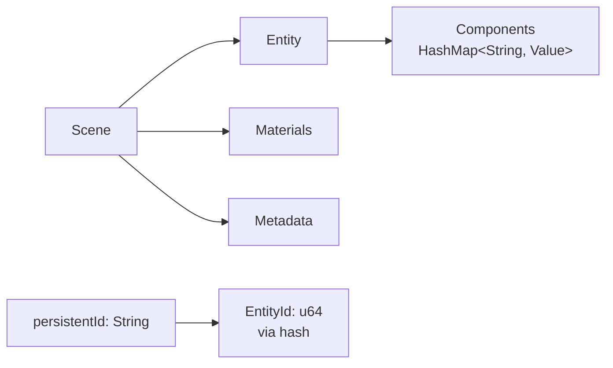

# vibe-scene

Core scene data model with stable IDs and JSON serialization.

## Key Types



**EntityId**: Stable 64-bit ID from hashing `persistentId` string. Same string → same ID.

**ComponentKindId**: String-based component type identifier (e.g., "Transform", "Camera").

## Design Decisions

**Why hash persistentId?**

- Fast numeric lookups instead of string comparisons
- Stable across sessions

**Why camelCase fields?**

- 1:1 compatibility with TypeScript JSON exports
- No serde rename complexity

**Why store components as JSON Value?**

- Unknown components don't break parsing
- Decoders handle typed extraction on-demand (see `vibe-ecs-bridge`)
- Extensible for editor features

## API

```rust
// Load scene
let scene: Scene = serde_json::from_str(json)?;

// Find entity
let entity = scene.find_entity_by_persistent_id("player")?;

// Check component
if entity.has_component("RigidBody") { ... }

// Query by component type
let cameras = scene.find_entities_with_component("Camera");
```

## Testing

Unit tests for EntityId hashing, component queries, serialization round-trips.

`cargo test -p vibe-scene`
