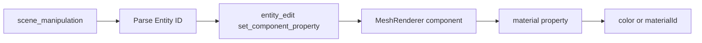

# Setting Materials and Colors



## Required: entity_edit tool

Steps:
1. Parse entity ID from response (e.g., "Entity ID: 42")
2. Use entity_edit with set_component_property:
   - component_type: "MeshRenderer"
   - property_name: "material"
   - property_value: `{ "color": "#ff0000" }`

## Example: Creating a Red Cube

**Step 1:** Add the entity

```json
scene_manipulation({
  "action": "add_entity",
  "entity_type": "Cube",
  "position": {"x": 0, "y": 0, "z": 0}
})
```

Response: "Added Cube to the scene at position (0, 0, 0). Entity ID: 42"

**Step 2:** Set the color

```json
entity_edit({
  "entity_id": 42,
  "action": "set_component_property",
  "component_type": "MeshRenderer",
  "property_name": "material",
  "property_value": { "color": "#ff0000" }
})
```

## Available Color Formats

- **Hex**: "#ff0000" (red), "#00ff00" (green), "#0000ff" (blue)
- **Named**: "red", "green", "blue", "yellow", "orange", "purple", etc.

## Using Material Assets

To use a specific material asset:

- property_name: "materialId"
- property_value: "mat_name_here" (use get_available_materials tool first)

## Critical Note

You MUST call entity_edit to set colors. scene_manipulation only creates entities with default materials.
