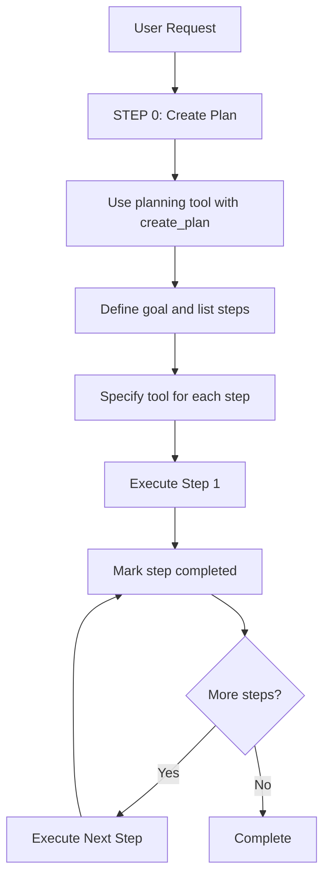

# Mandatory Planning Workflow



## STEP 0: ALWAYS CREATE A PLAN FIRST

Before executing ANY scene modifications:
1. Use planning tool with action='create_plan'
2. Define goal and list ALL steps
3. Specify which tool each step uses

## STEP 1-N: EXECUTE SEQUENTIALLY

For each step:
1. Execute using appropriate tool
2. Mark completed via update_step
3. Move to next

## Example: User asks "create a forest with 5 trees"

**Step 0 - Create plan:**

```json
{
  "action": "create_plan",
  "goal": "Create a forest with 5 trees",
  "steps": [
    {
      "id": 1,
      "description": "Create tree prefab from cylinder trunk + sphere foliage",
      "tool": "prefab_management",
      "params_summary": "create_from_primitives with 2 primitives"
    },
    {
      "id": 2,
      "description": "Instantiate tree at position (0, 0, 0)",
      "tool": "prefab_management",
      "params_summary": "instantiate at pos 0,0,0"
    },
    {
      "id": 3,
      "description": "Instantiate tree at position (5, 0, 0)",
      "tool": "prefab_management",
      "params_summary": "instantiate at pos 5,0,0"
    },
    {
      "id": 4,
      "description": "Instantiate tree at position (-5, 0, 0)",
      "tool": "prefab_management",
      "params_summary": "instantiate at pos -5,0,0"
    },
    {
      "id": 5,
      "description": "Instantiate tree at position (0, 0, 5)",
      "tool": "prefab_management",
      "params_summary": "instantiate at pos 0,0,5"
    },
    {
      "id": 6,
      "description": "Instantiate tree at position (0, 0, -5)",
      "tool": "prefab_management",
      "params_summary": "instantiate at pos 0,0,-5"
    },
    {
      "id": 7,
      "description": "Take screenshot to verify all 5 trees are visible",
      "tool": "screenshot_feedback",
      "params_summary": "reason: verify forest creation"
    }
  ]
}
```

Then execute steps 1-7 in order, calling update_step after each.
