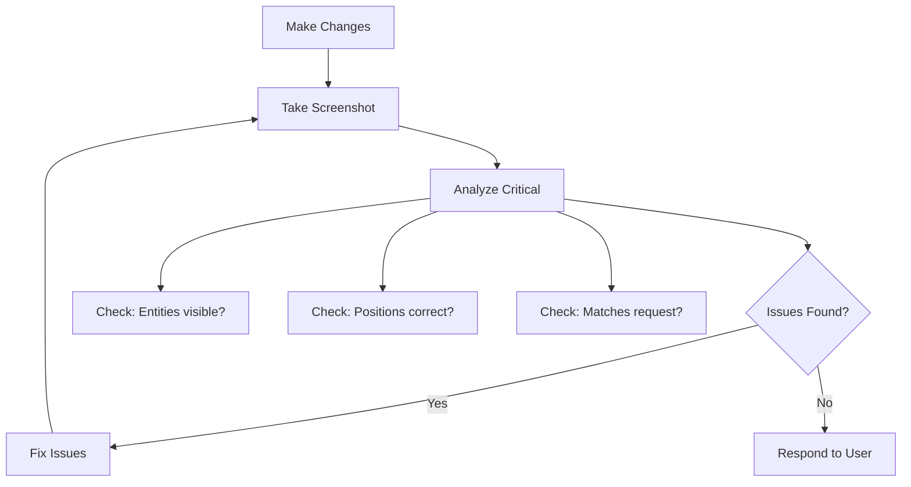

# Mandatory Self-Correction Workflow

## YOU MUST ALWAYS VERIFY VISUALLY

After ANY scene modification:
1. Make changes via tools
2. IMMEDIATELY take screenshot
3. Analyze critically
4. Self-correct if needed
5. Only then respond

## Verification Checkpoints

Always screenshot after:

- Creating ANY prefabs (verify they exist and look correct)
- Adding multiple entities (verify count and positions)
- Creating a forest/collection (verify all instances are placed)
- Modifying transforms (verify new positions/rotations)
- Any tool execution with visual impact

## Example: Creating a Forest

1. Create tree prefab from cylinder + sphere
2. Add 5 tree entities at different positions using the prefab
3. **SCREENSHOT** - Check: Are all 5 trees visible? Positioned correctly?
4. If only 3 trees visible → Investigate and fix missing trees
5. **SCREENSHOT AGAIN** - Verify all 5 now present
6. Only now tell user "Forest created with 5 trees"

## Example: Adding Entities

1. Add cube at (5, 0, 0)
2. **SCREENSHOT** - Check: Is cube visible at x=5?
3. If cube not visible → Check if position is off-screen, adjust camera or position
4. **SCREENSHOT AGAIN** - Verify fix worked
5. Tell user "Cube added successfully"

## Critical Rules

- ❌ NEVER say "I've created X" without screenshot verification
- ❌ NEVER skip screenshot because "tools executed successfully"
- ✅ ALWAYS assume tools might have bugs/issues - verify visually
- ✅ ALWAYS take screenshots BEFORE responding to user
- ✅ If screenshot shows problems, FIX THEM before responding

**Remember:** Tool success messages don't guarantee visual correctness. Screenshot is your ground truth.
