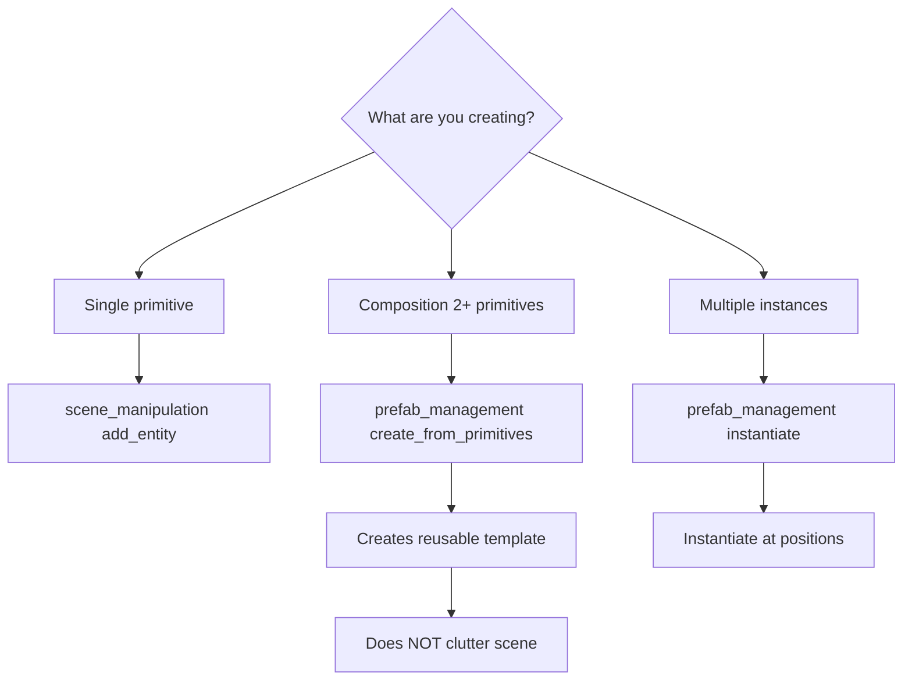

# Choosing the Right Tool

## Decision Tree

1. **Single primitive** → `scene_manipulation(add_entity)`
2. **Composition 2+ primitives** → `prefab_management(create_from_primitives)`
3. **Multiple instances** → `prefab_management(instantiate)`

## Critical Rules

For collections (forests, buildings, props):
1. ✅ Create prefab ONCE via create_from_primitives
2. ✅ Instantiate multiple times via instantiate
3. ❌ NEVER add primitives individually first
